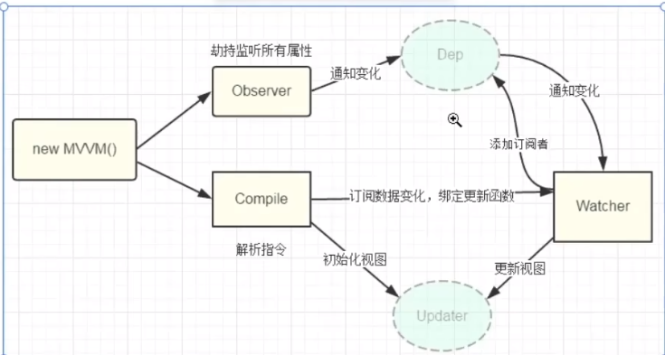

三部分

1. 数据层 model 存储数据及业务逻辑
2. 视图层view 展示效果
3. 业务逻辑层 viewModel   数据  视图

数据 视图

1. observer : 对所有数据的属性进行监听

2. complier : 更新

1. new Vue()

2. Observer 劫持监听所有的属性 通知变化Dep watcher 视图更新 Updater
3.  Compiler 订阅数据变化 watcher

{.imgcenter}
------

#### 数据双向绑定原理（官方说法）

 通过数据劫持和发布订阅者模式来实现，同时利用Object.defineProperty()劫持各个属性的setter和getter，

在数据发生改变的时候发布消息给订阅者，触发对应的监听回调渲染视图，也就是说数据和视图时同步的，数据发生改变，视图跟着发生改变，视图改变，数据也会发生改变。

​    第一步：需要observer的数据对象进行递归遍历，包括子属性对象的属性，都加上setter和getter

​    第二步：compile模板解析指令，把模板中的变量替换成数据，然后初始化渲染视图，同时把每个指令对应的节点绑定上更新函数，添加订阅者，如果数据变化，收到通知，更新视图

​    第三步：Watcher订阅者是Observer和Compile之间的通信桥梁，作用：

​        1.在自身实例化的时候忘订阅器内添加自己

​        2.自身要有一个update()方法

​        3.等待属性变动时，调用自身的update方法，触发compile这种的回调

​    第四步：MVVM作为数据绑定的入口，整合了observer、compile和watcher三者，通过observer来监听自己的数据变化，通过compile解析模板指令，最后利用watcher把observer和compile联系起来，最终达到数据更新视图更新，视图更新数据更新的效果